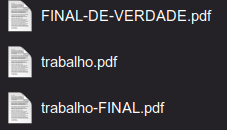
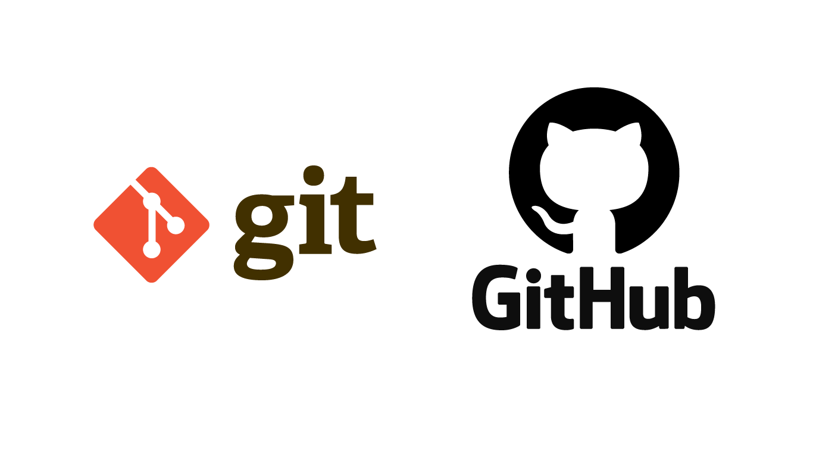

# Minicurso GIT

Ministrado por: Edmar Caixeta Filho
Produzido em: Abril/2021

---

### Quem sou eu?


Discente de Engenharia de Computação pela UFMS (2019 - ~~Ad infinitum~~), já participei da equipe de robótica Ararabots (2019) na categoria Very Small Size Soccer. Atualmente, participo de uma Iniciação Científica (PIBIC) em processamentos de imagens por Deep Learning em parceria com a Empresa Brasileira de Pesquisa Agropecuária (EMBRAPA). Minha principal linguagem de programação é Python e não tenho medo de C/C++. Tenho um gato que se chama Oswaldo ;)

Saiba mais, através desse [link](https://linktr.ee/edmarcaixeta).

---

## Notas Prévias:

Esse tutorial parte do pressuposto de que você tem **noções básicas** de como operar o terminal, *seja qual for o seu SO*, caso **não** seja o seu caso, sugiro que instale o *Git Kraken* ou o *GitHub Desktop* que é uma forma de operar o Git com interface gráfica e os conceitos são os mesmos. 

Se você não entendeu uma parte, prossiga sua leitura poderá fazer sentido mais a frente.

Recomendo que você teste os comandos conforme progride em sua leitura, a fixação é mais fácil assim. 

Não se preocupe em decorar os comandos inicialmente, com a prática você os decorará sem perceber.

---

## Sumário:

[1 - Mas o que raios é Git?](https://github.com/EdmarCaixeta/mini-curso-git/blob/master/Notes/Apostila%20Git.md#1---mas-o-que-raios-%C3%A9-git)

[1.1 - Git e GitHub/GitLab/BitBucket/Outros NÃO são a mesma coisa!](https://github.com/EdmarCaixeta/mini-curso-git/blob/master/Notes/Apostila%20Git.md#11---git-e-githubgitlabbitbucketoutros-n%C3%A3o-s%C3%A3o-a-mesma-coisa)

[1.2 - Motivação](https://github.com/EdmarCaixeta/mini-curso-git/blob/master/Notes/Apostila%20Git.md#12---motiva%C3%A7%C3%A3o)

[2 - Instalação](https://github.com/EdmarCaixeta/mini-curso-git/blob/master/Notes/Apostila%20Git.md#2---instala%C3%A7%C3%A3o)

[2.1 - Linux](https://github.com/EdmarCaixeta/mini-curso-git/blob/master/Notes/Apostila%20Git.md#21---linux)

[2.2 - Windows](https://github.com/EdmarCaixeta/mini-curso-git/blob/master/Notes/Apostila%20Git.md#22---windows)

[2.3 - MacOS](https://github.com/EdmarCaixeta/mini-curso-git/blob/master/Notes/Apostila%20Git.md#23---macos)

[3 - Repositórios e Commits](https://github.com/EdmarCaixeta/mini-curso-git/blob/master/Notes/Apostila%20Git.md#3---reposit%C3%B3rios-e-commits)

[3.1 - Reposiório Local](https://github.com/EdmarCaixeta/mini-curso-git/blob/master/Notes/Apostila%20Git.md#31---reposit%C3%B3rio-local)

[3.2 - Repositório Remoto](https://github.com/EdmarCaixeta/mini-curso-git/blob/master/Notes/Apostila%20Git.md#32---reposit%C3%B3rio-remoto)

[4 - Começando de fato...](https://github.com/EdmarCaixeta/mini-curso-git/blob/master/Notes/Apostila%20Git.md#4---come%C3%A7ando-de-fato)

[5 - Branches](https://github.com/EdmarCaixeta/mini-curso-git/blob/master/Notes/Apostila%20Git.md#5---branches)

[6 - Repositórios Remotos](https://github.com/EdmarCaixeta/mini-curso-git/blob/master/Notes/Apostila%20Git.md#6---reposit%C3%B3rios-remotos)

[Curiosidades](https://github.com/EdmarCaixeta/mini-curso-git/blob/master/Notes/Apostila%20Git.md#curiosidades)

[Feedback](https://github.com/EdmarCaixeta/mini-curso-git/blob/master/Notes/Apostila%20Git.md#feedback)

[Agradecimentos](https://github.com/EdmarCaixeta/mini-curso-git/blob/master/Notes/Apostila%20Git.md#agradecimentos)

[Custos](https://github.com/EdmarCaixeta/mini-curso-git/blob/master/Notes/Apostila%20Git.md#custo)

## 1 - Mas o que raios é Git?

Git é um software de versionamento de projetos de qualquer natureza (geralmente adotado para versionamento de códigos, mas pode ser adotado em qualquer tipo de projeto, como LaTeX, Notebooks, etc), desenvolvido por [Linus Torvalds](https://pt.wikipedia.org/wiki/Linus_Torvalds) (criador do sistema operacionall Linux) em 2005.
Basicamente, o Git rastreia modificações nos projetos de forma a permitir o retorno a edições anteriores e criação de diferentes ramos.



O Git evita situações como a da foto acima, que tenho **certeza** que todos vocês já fizeram isso 🤣.
Ao utilizar o Git, o **único** arquivo existente seria "trabalho.pdf" e seria possível navegar entre suas versões sem sobrescrita e perda de dados. 

### 1.1 - Git e GitHub/GitLab/BitBucket/Outros NÃO são a mesma coisa!



Como explicado anteriormente, o Git é um programa de versionamento de projetos, já o GitHub e afins são serviços de **repositório remoto**. Por hora, entenda repositórios remotos como uma forma de hospedar seu versionamento online.

### 1.2 - Motivação

1. **Evita criar arquivos como forma de versionamento** → Como explicitado acima.
2. **É escalável** →Conforme o seu projeto cresce em número de arquivos ainda é possível gerenciar as alterações, enquanto no modo de criação de arquivos para versionamento fica praticamente impossível.
3. **Proporciona o trabalho em equipe** →Possui features como Pull Request, Merge e Branches que facilita o trabalho em equipes de qualquer tamanho.
4. **Possui versão para qualquer SO e suporte a utilização direta no terminal →**Embora trabalhar diretamente no terminal é algo bem mais rápido, há ferramentas mais amigáveis para manuntenção Git, como o **Git Kraken**.
5. **O Git serve como portfólio** → várias empresas pedem o seu Git como portfólio para saber como você se organiza em seus projetos.
6. **Utilização é simples.**
7. **Utilizado por TODAS as empresas na área de desenvolvimento.**
8. **Aplicações Web →**há como desenvolver de forma que as modificações no seu repo sejam implementadas diretamente no seu website em tempo real.

Mas como fazer isso? Será discutido nas próximas seções.

## 2 - Instalação

Para qualquer problema na instalação descrita abaixo, consultar a [documentação](http://git-scm.com/). Afinal, aqui só está reunido informações da própria documentação do site oficial do [Git](http://git-scm.com/).

### 2.1 - Linux

Pelo terminal basta digitar:

```bash
sudo apt install git
```

Para verificar se a instalação está correta basta digitar:

```bash
git --version
```

### 2.2 - Windows

Através do gerenciador de pacote Chocolatey, basta digitar no PowerShell:

```bash
choco install git.install
```

Para verificar se a instalação está correta basta digitar:

```bash
git --version
```

Ou você pode instalá-lo através do instalador padrão, disponível nesse [link](http://git-scm.com/download/win).

### 2.3 - MacOS

Através do gerenciador de pacote Brew, basta digitar no terminal:

```bash
brew install git
```

Para verificar se a instalação está correta basta digitar:

```bash
git --version
```

## 3 - Repositórios e Commits

O conceito de repositórios é inerente a utilização do Git, repositórios são nada mais que espaços destinados a guardar uma determinada informação, no nosso caso, nossos projetos. Existem **dois** tipos de repositórios:

### 3.1 - Repositório Local

Os repositórios locais nada mais são que as informações guardadas na nossa máquina, ou seja, **localmente**.

Por exemplo, o nosso arquivo "trabalho.pdf" originalmente não está salvo em nenhum outro lugar a não ser na nossa própria máquina, ou seja, considere que você não enviou a versão FINAL-DE-FATO para o seu amigo ou professor.

Então o nosso computador é o nosso **repositório local**. E o histórico de mudanças está salvo apenas nele.

### 3.2 - Repositório Remoto

Os repositórios remotos são serviços que possibilitam salvar as informações dos nossos repositórios de **forma remota**, ou seja, **online**.

Desta forma, podemos continuar nosso progresso em outras máquinas ou implementar nossas modificações em projetos em grupos.

Voltando ao exemplo do projeto "trabalho.pdf", essa seria a etapa que enviamos a nossa versão ao Google Drive e nosso amigo acessa possibilitando a ele inserir suas modificações.

Então a página do nosso projeto no GitHub, GitLab ou outros serviços é o nosso **repositório** **remoto**.

### Mas como funciona o versionamento?

O versionamento funciona através do comando:

```bash
git commit
```

Commit's nada mais são que ***checkpoints***, ou seja, em um projeto qualquer você implementou uma feature e ela está funcional na sua aplicação e você decide salvar o projeto no estado atual, você dá commit nas suas modificações, para poder testar coisas novas e caso não dê certo você pode voltar ao estado do commit.

Ficará mais claro posteriormente, **prometo**.

## 4 - Começando de fato...

Nota: por conveniência abreviaremos repositório como repo.


Abra o diretório do seu projeto no terminal. E digite o seguinte comando:

```bash
git status
```

O terminal deverá retornar:

```bash
fatal: not a git repository (or any of the parent directories): .git
```

O terminal retornou essa mensagem pois não inicializamos o diretório como um repositório, para isso digitamos:

```bash
git init

#Se for a primeira vez que usar o Git na sua máquina os comandos abaixo também serão necessários para identificação
git config --global user.name "<user_name>" 
git config --global user.email "<user_email@email.com>"
```

E se inserirmos "*git status"* novamente veremos que iniciamos um repo vazio (sem nenhum arquivo sendo rastreado ainda), mesmo se o nosso diretório não estiver vazio (no meu caso há o arquivo "index.html", mas isso é arbitrário, ou seja, você pode ter o arquivo que você quiser).


Para adicionar arquivos ao repo, basta utilizar o comando:

```bash
git add <file_name>
```

Desta forma, teremos que:


O meu arquivo "index.html" é um arquivo em branco, não há nada nele. Caso eu efetue um commit agora, a única mudança registrada seria a adição do arquivo ao repo. Mas vou modificá-lo antes de fazer o primeiro commit:


Não se importe se você **não entendeu** bulhufas do código acima, apenas quero que entenda que o código a esquerda reproduz essa página no navegador. (Sim, escrevemos Git errado de próposito). Que tal se checarmos o status do nosso repo agora?


As modificações já foram identificadas pelo Git! Mas e agora? 

Temos **duas** opções! **Apagar** as modificações ou **Salvá-las**!

```bash
#Desfaz as modificações
git restore index.html

#Salva as modificações
git add index.html
git commit -m "Add body and head"
```

A flag "-m" serve para anexar uma mensagem ao commit que está entre aspas, mas pode ser qualquer coisa que você desejar. É uma boa prática indicar de forma **concisa** a modificação feita (ainda mostrarei o por quê). Se a flag não for utilizada o terminal abrirá uma página com editor de texto para você inserir essa mesma mensagem, a flag é mais prática. 

Sugiro que testem fazer o commit sem adicionar os arquivos que mudaram. E ver o que acontece.

O status retornará que não há mudanças para subir. **Pronto, criamos nossa primeira versão!**

 

Teste o comando "*git log*" para ver o histórico de commits do seu repo.

Caso deseje retornar a um commit use o comando:

```bash
git checkout <commit_key>
```

Ao usar o "*git log*" você verá que os commits são nomeados com chaves, elas podem ser usadas para acessá-los ou para usar o comando diff que você verá mais a frente.

### Resumo do que aprendemos até agora

- Inicializar um repo local
- Conferir o status do repo
- Adicionar arquivos ao repo
- Commit
- Restore
- Transitar entre Commits
- Log

## 5 - Branches

Um conceito importante e muito útil para nós é o conceito de branch, em tradução livre, ramificação. Usamos os branches de forma ímplicita até agora, ao utilizar o comando "*git stauts*" o terminal retorna "*On branch master, nothing to commit*", ou seja, qualquer commit que fizermos estamos atualizando o branch master, que é o **ramo principal** da nossa aplicação.

A imagem abaixo tem uma representação muito boa do processo. Há dois **branches**, *master* e *new_feature*, cada círculo representa um commit. Note que o primeiro commit de new_feature se origina de master.


Após a ramificação, new_feature faz outro commit onde imaginamos que uma nova feature esteja pronta para se fundir com o branch master, representado pela função **merge** (será discutida mais para frente).

### Tá, mas como assim ramificação?


Se você vive no século 21, você com certeza já assistiu Vingadores Ultimato.

A imagem acima mostra a cena de Vingadores: Ultimato em que Bruce Banner a.k.a Hulk encontra a Anciã e lhe pede a gema do infinito do tempo. Em sua explicação ela diz que se a entregar criará ramificações na linha temporal, mas o que isso tem a ver com Git e branches? 

Você criará ramificações na linha do tempo? **SIM**, na linha do tempo do seu projeto.

Imagine que a linha atual (laranja) é o seu branch Master, lá está tudo funcional (uma versão definitva) do seu código.

Ao criar um novo branch, você cria uma ramificação (a linha preta) e é onde você pode criar novas features e dar commits que não impactarão o código já funcional (branch master).

### Um novo branch é uma área de testes

Um novo branch é uma área de testes, onde você poderá testar novos estilos, novas features, o que você quiser. É importante que você se certifique que o novo branch está realmente funcional antes de mesclar (**merge**) com o branch master, se é que você pretende fazer isso. **Nem sempre um novo branch é implementado.**

### Comandos e mais comandos... 💤

Os comandos para alteração de branches:

```bash
git branch #Lista todos os branches do repo
git branch <name_of_branch> #Cria um novo branch
git branch -D <name_of_branch> #Deleta um branch localmente
git checkout <name_of_branch> #Muda de branch para o que você acabou de criar
```

No caso do meu projeto exemplo, eu criei um novo branch chamado *text_fix,* onde eu consertei o texto que estava errado (lembra que eu disse que era proposital?), e adicionei uma estilização.


O * indica o branch que estou.


Alteração no código


Resultado

Bom, o código está funcional e então desejo mesclar ele ao branch *master.* Como fazer?

Certifique-se de que vc deu commit nas modificações no seu novo branch, depois:

```bash
git checkout master #Certique-se de estar no repo que receberá o conteúdo novo
git merge <name_of_branch> 
```

### Por que branches são importantes?

Segurança!

Em projetos maiores, uma boa organização é imprescindível para o sucesso do seu projeto. Há projetos em que o ramo master é uma aplicação direta para usuários, e enviar mudanças que podem não estar estáveis direto para eles pode criar Bugs ou fazer até mesmo com que o sistema não funcione. 

Em projetos com outras pessoas, imagine que você e seu colega fizeram uma implementação ao mesmo tempo que mexa com a mesma parte do código. E ambos subiram direto para a master, isso implica que os dados de alguém será sobrescrito ou pode até colapsar o código. Dessa forma, cada um cria um branch, faz suas devidas modificações e criam um ***Pull-request*** (termo **importante** que será abordado a seguir), que é uma permissão para dar merge. Dessa forma conflitos poderão ser resolvidos antes do merge e implica numa conscisão maior.

## 6 - Repositórios Remotos

Como explicado anteriormente, repositório remoto é um serviço para armazenar seu projeto em um servidor remoto a fim de ser possível utilizá-lo em outras máquinas, para outras pessoas poderem alterá-lo (projetos em grupos), backup, ou até mesmo por portfólio (afinal seu repositório pode ser público ou privado).

Por questão de gosto, escolherei o GitHub para hospedar meu repositório remoto. Caso queira utilizá-lo, entre no [site](http://github.com) e se cadastre. Depois de devidamente cadastrado, procure a opção para criar um novo repositório.


Deixarei meu repositório público, seu nome será "mini-curso-git" e deixarei os outros campos em branco por hora.

Após criar o repo remoto no seu serviço de escolha, basta usar os comando abaixo:

```bash
git remote add origin <remote_repo_link> #Adiciona um repo remoto
git push -u origin main #Sobe as modificações do seu repo local para o seu repo remoto
```

### Pronto! Você tem um repositório local e remoto!

Agora será descrito como usá-lo e não é nada complicado, acredite.

### Pull vs Push

Os comandos mais triviais quando se tem um repositório remoto, são eles que fazem o mapeamento entre seu repo local e o remoto. Como assim?

```bash
git pull #Faz com que o repo local baixe as atualizações do repo remoto
git push #Sobe as alterações feitas no repo local para o repo remoto
```

O comando "*git push"* havia sido utilizado logo acima com a flag "*-u*" seguida de "*origin main"* mas não se preocupe essa flag só é passada quando dermos nosso primeiro push.

### Diff

O comando utilizado para ver as diferenças entre versões. Por exemplo:

```bash
git log
```


É possível acessar os commits anteriores pela chave deles, isto é, esse código a frente de commit. Como pode ser observado a baixo.

```bash
git diff ffe33ad2c226f472c91e29b4bcf229bd43b39049
```


O código acima representa todas as mudanças entre o meu branch mais recente até o meu primeiro commit (cuja chave é esse monstro visto no git log)

### Pull-Request

Pull-requests (PR) não são operações feitas diretamente no terminal e em uma forma simples é uma autorização de merge. Utilizados em projetos em equipes é extremamente útil para que todos saibam o que será inserido na master.

Para criar um PR basta ir no repo remoto e lá tem a aba Pull Requests, lembrando que você deve ter um branch naquele repo e você pode solicitar o merge com algum outro branch.

A boa prática diz que você faz o PR e outra pessoa aceita.

É também uma forma de contribuir em projetos Open-source, você pode clonar os repositórios de um projeto que queira contribuir fazer o seu branch e solicitar a implementação dele na master

---

## Curiosidades:

Todo diretório que é um repositório terá dois arquivos gerados ao dar o comando "git init", uma pasta chama .git e um arquivo chamado .gitignore. Ambos são ocultos e suas funcionalidades são:
armazena todo o histórico de modificações tal como as configurações do seu repo, arquivos ignorados pelo git (setados anteriormente pelo git rm <name_of_file>, se usado), respectivamente.

Caso queira desfazer o diretório como repositório basta apagar o diretório .git.

---

## Feedback:

Críticas construtivas são sempre bem vindas e se possível por favor deixe um comentário, no que eu posso melhorar ou se você gostou de tudo expresse isso também! Se não gostou de nada, pelo menos justifique o por quê.

---

## Agradecimentos:

Agradeço a você que teve força e resiliência de acompanhar esse tutorial até o final. Espero que sua jornada seja mais produtiva com a ferramenta que lhe apresentei e que contribua com algum repo Open-Source por aí ou crie algo relevante e disponibilize isso para todos.

Agradeço também [Yan Uehara](https://github.com/yanuehara) pela revisão do texto.

---

## Custo:

Acredito que o conhecimento não deva ser cobrado e que deve ser de livre acesso a todos, por isso não cobrei nada por divulgar tais conhecimentos. Mas se mesmo assim deseja pagar pelo que aprendeu, você pode fazer uma doação pelo meu [PicPay](http://picpay.me/edmar.caixeta).
